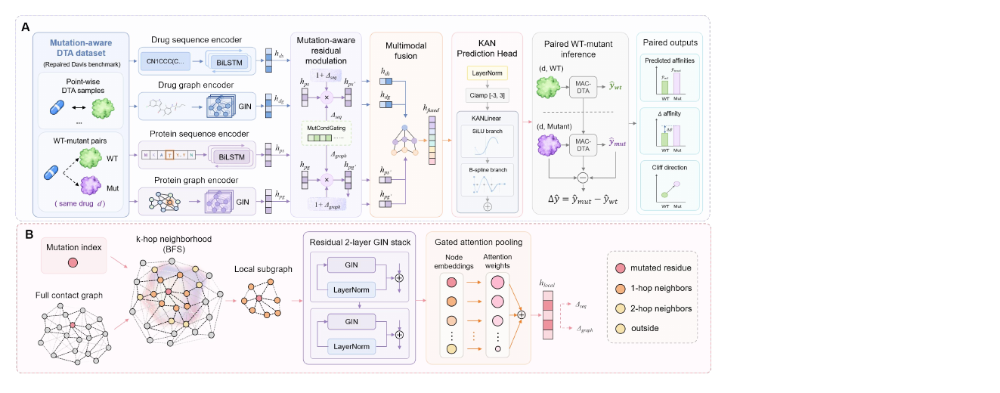

# Overcoming Amino Acid Mutation-Mediated Drug Resistance: A Multimodal AI Framework for Drug-Target Affinity Prediction

MAC-DTA is a mutation-aware multimodal model for drug-target affinity
prediction. It integrates drug and protein sequence/graph representations,
mutation-centred local information, KD Guard, WT-mutant pairwise ranking, and
a Kolmogorov-Arnold Network (KAN) prediction head.

## Framework



## Run Code

```bash
python main.py
```

## Requirements

- Python==3.10
- torch==2.7.0
- torch-geometric==2.7.0
- torch-scatter==2.1.2
- rdkit==2024.3.5
- numpy==1.26.4
- pandas==1.5.3
- scikit-learn==1.7.2
- scipy==1.11.4
- tqdm==4.67.1
- networkx==3.1

## Citation

If you find this work useful in your research, please consider citing the
MAC-DTA article. The complete citation will be added after publication.
